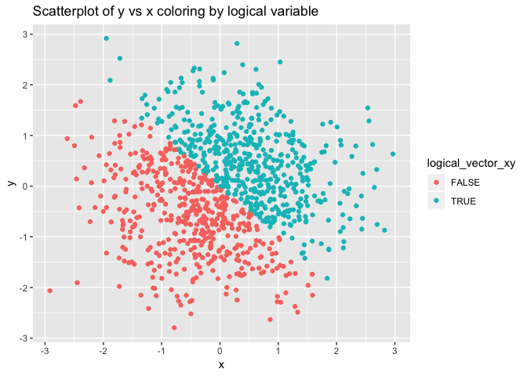
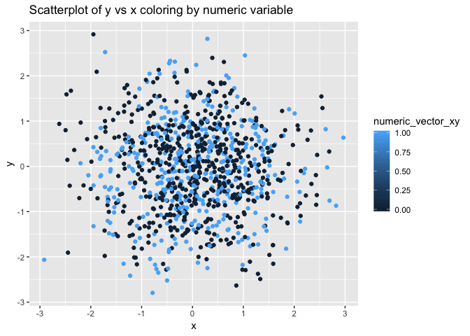
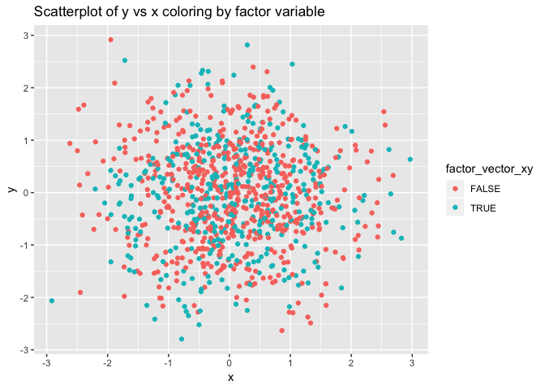

p8105\_hw1\_xy2397
================
Xue Yang
2018-09-16

Problem 1
=========

Question:
---------

Create a data frame comprised of:

-   A random sample of size 10 from a uniform\[0, 5\] distribution
-   A logical vector indicating whether elements of the sample are greater than 2
-   A (length-10) character vector
-   A (length-10) factor vector

Try to take the mean of each variable in your dataframe. What works and what doesn’t? Why?

In some cases, you can explicitly convert variables from one type to another. Write a code chunk that applies the as.numeric function to the logical, character, and factor variables (please show this chunk but not the output). What happens? In a second code chunk, convert your character variable from character to factor to numeric; similarly, convert your factor variable from factor to character to numeric. What happens?

Solution:
---------

1.  Firstly, creating the data frame

``` r
# A random sample of size 10 from a uniform[0, 5] distribution
uniform_sample = runif (10, 0, 5)

# A logical vector indicating whether elements of the sample are greater than 2
logical_vector = uniform_sample > 2

# A (length-10) character vector
character_vector = c('a', 'b', 'c', 'd', 'e', 'f', 'g', 'h', 'i', 'j')

# A (length-10) factor vector
factor_vector = factor(c(1, 2, 3, 4, 5, 5, 4, 3, 2, 1))

# Creating them to be a data frame
data_frame = data.frame(uniform_sample, logical_vector, character_vector, factor_vector)
```

1.  Secondly, take the mean of each variable in the dataframe

-   The mean of the uniform\_sample is 2.1209656.
-   The mean of the logical\_vector is 0.4.
-   The mean of the character\_vector is NA.
-   The mean of the factor\_vector is NA.

From the results of mean for each variable, we can find that only vaiables uniform\_sample and logical\_vector have mean, While the variables character\_vector and factor\_vector only returned NA.

It is easy to explain: only numeric and logical variable can be calculated the exact mean. While character or factor variables can not be calculated the exact mean. Variable character\_vector and factor\_vector are not numeric or logical (they are character or factor), as a result, R can only returning NA for them.

1.  Last, explicitly convert variables from one type to another.

-   By applies the as.numeric function to the logical, character and factor variable, in this case, we can find that all these variable changed into numeric. That's to say, for logical variable, TRUE is assigned to 1 and FALSE is assigned to 0. And for character and factor variable, they are both coercively assigned to numeric variables.

``` r
as.numeric(data_frame$logical_vector)
as.numeric(data_frame$character_vector)
as.numeric(data_frame$factor_vector)
```

-   By converting character variable from character to factor to numeric in this case, we can find that the character variable finally changed into numeric from 1 to 10.

``` r
# First convert character variable from character to factor
as.factor(data_frame$character_vector)
```

    ##  [1] a b c d e f g h i j
    ## Levels: a b c d e f g h i j

``` r
# Then covert it from factor to numeric
as.numeric(as.factor(data_frame$character_vector))    
```

    ##  [1]  1  2  3  4  5  6  7  8  9 10

-   Similarly, in this case, by converting factor variable from factor to character to numeric, we can find that when we coercively covert the variable, the factor variable finally convert into numeric variable.

``` r
# First convert factor variable from factor to character
as.character(data_frame$factor_vector)
```

    ##  [1] "1" "2" "3" "4" "5" "5" "4" "3" "2" "1"

``` r
# Then covert it from character to numeric
as.numeric(as.character(data_frame$factor_vector))
```

    ##  [1] 1 2 3 4 5 5 4 3 2 1

Problem 2
=========

Question:
---------

This problem focuses on plotting and the use of inline R code.

Create a data frame comprised of:

-   x: a random sample of size 1000 from a standard Normal distribution
-   y: a random sample of size 1000 from a standard Normal distribution
-   A logical vector indicating whether the x + y &gt; 0
-   A numeric vector created by coercing the above logical vector
-   A factor vector created by coercing the above logical vector

Write a short description of your vector using inline R code, including: \* the size of the dataset \* the mean and median of x \* the proportion of cases for which the logical vector is TRUE

Make a scatterplot of y vs x; color points using the logical variable (adding color = ... inside of aes in your ggplot code should help). Make a second and third scatterplot that color points using the numeric and factor variables, respectively, and comment on the color scales.

Export your first scatterplot to your project directory using ggsave.

Solution:
---------

1.  Firstly, creating the data frame

``` r
# x: a random sample of size 1000 from a standard Normal distribution
x = rnorm(1000)

# y: a random sample of size 1000 from a standard Normal distribution
y = rnorm(1000)

# A logical vector indicating whether the x + y > 0
logical_vector_xy = x+y > 0

# A numeric vector created by coercing the above logical vector
numeric_vector_xy = as.numeric(logical_vector)

# A factor vector created by coercing the above logical vector
factor_vector_xy = as.factor(logical_vector)

# Creating them to a data frame
data_frame_xy = data.frame(x, y,logical_vector_xy,numeric_vector_xy,factor_vector_xy)
```

1.  Writing a short description of the vector

-   the size of the dataset is 1000 rows and 5 columns.
-   the mean of x is 0.0491364 and median of x is 0.0564348.
-   the proportion of cases for which the logical vector is TRUE is 0.518.

1.  Making scatterplots of y vs x

-   First scatterplot color points using the logical variable

``` r
# using funtion ggplot to make a scatterplot which color points use the logical variable
ggplot(data_frame_xy, aes(x = x, y = y, color = logical_vector_xy))+
geom_point()+
labs(title = "Scatterplot of y vs x coloring by logical variable") 
```



-   And export this scatterplot to project directory

``` r
# use ggsave function to export this scatterplot to my project directory
ggsave(filename = "first scatterplot.png",ggplot(data_frame_xy, aes(x = x, y = y, color = logical_vector_xy))+
geom_point()+
labs(title = "Scatterplot of y vs x coloring by logical variable") )
```

    ## Saving 7 x 5 in image

-   Second scatterplot color points using the numeric variable

``` r
# using funtion ggplot to make a scatterplot which color points use the numeric variable
ggplot(data_frame_xy, aes(x = x, y = y, color = numeric_vector_xy))+
geom_point()+
labs(title = "Scatterplot of y vs x coloring by numeric variable") 
```



-   Third scatterplot color points using the factor variable

``` r
# using funtion ggplot to make a scatterplot which color points use the factor variable
ggplot(data_frame_xy, aes(x = x, y = y, color = factor_vector_xy))+
geom_point()+
labs(title = "Scatterplot of y vs x coloring by factor variable") 
```



By looking through these three scatterplot, we can find that the color scale of the first one is different from the second one and the third one, but there is no difference between the color scales from the second one to the third one.

It is easy to explian, since both x and y are random sample from standard normal distribution, so the number of x or y larger than 0 is almost the same as the number of x or y smaller than 0, and furthermore, the number of x+y larger than 0 also almost the same as the number of x+y smaller than 0.

When we use logical variable to color the point, the points can be separated by the line: x+y=0, above the line means x+y&gt;0, and below the line means x+y&lt;0. While when we use numeric and factor variables to color the points, since both numeric and factor created by coercing the logical vector, so the numerics equaling to 1 or 0 scale uniform and the factors leveling TRUE or FALSE scale uniform.
